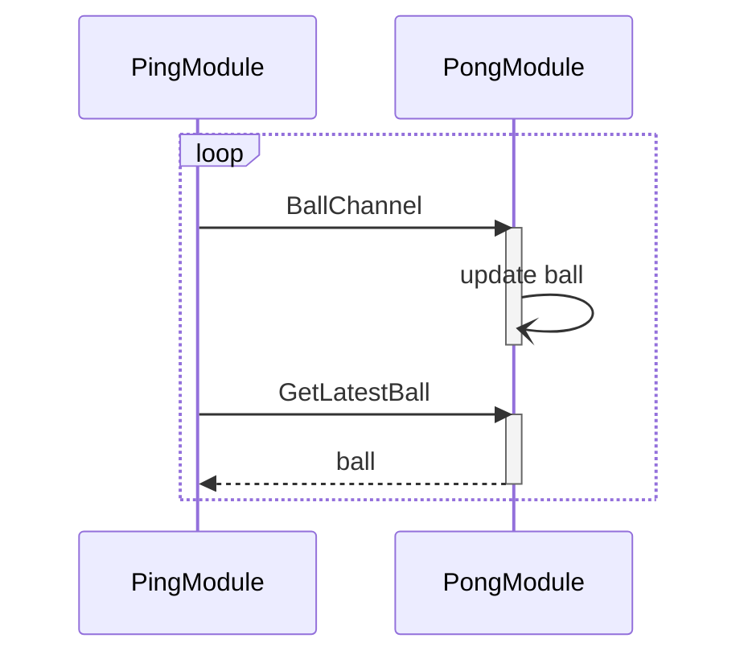

# AimRTe Example: module

[TOC]

[返回上一层](../README.md)

## 1. 基本概念

首先，AimRTe 是 AimRT extension 的意思，下文介绍的概念是从 AimRT 的使用逻辑定义出来的，AimRTe 仅做了使用方式上的封装。

**模块** 是 AimRT 框架中的最小管理单位，其中，管理的含义包括：

- 框架层可见的生命周期管理，包括**初始化**、**启动**、**关闭**；
- 通信、执行器、日志、配置、参数等系统资源的划分统筹；
- 执行状态管理与通信数据链路分析的主体。

在一个 **进程** 中，可以同时启动多个模块，启动方式有两种：

- **pkg** 模式：多个模块以动态库的形式，被 aimrt_runtime_main 程序根据启动参数动态地加载到进程中来；
- **app** 模式：多个模块在同一个 main 函数中，被显式地注册到 aimrt::AimRTCore 中，直接连接为同一个进程、随 AimRT 框架同时加载到内存中。

更多关于 pkg 模式与 app 模式的使用示例，可前往 [example/program](../program/README.md) 查看。为简单起见，本例程使用 app 模式。


## 2. 例程介绍

本例程主要介绍模块的基本功能的基础用法，包括：

- 基于 pub/sub 模式的通信；
- 基于 rpc 模式的通信；
- 日志输出；
- 配置读取；
- 基于执行器的异步任务；
- 基本程序框架与启动方法。


本例程中将设计两个模块：PingModule 与 PongModule，完成经典的“传球”过程：



如图所示，PingModule 会周期性发送球信息、并向 PongModule 发起 rpc ，拿回刚传过去的球。


## 3. 执行说明

本例程中的两个模块需要被启动为两个进程，在 install 目录下，已为它们各配置了一份脚本与启动配置。

需要注意的是，该例程使用 **mqtt** 通信，读者可能需要先在本地安装 mqtt broker 环境：

```sh
sudo snap install emqx
sudo emqx start
```

可以在浏览器输入 http://127.0.0.1:18083/ 进入 mqtt 的管理页面（默认账号密码为 admin 与 public），确认是否安装成功。

若使用 Docker 环境启动的程序，需要将 install 目录下的 mqtt broker ip 配置，修改为宿主机的 ip.


---

[返回上一层](../README.md)
